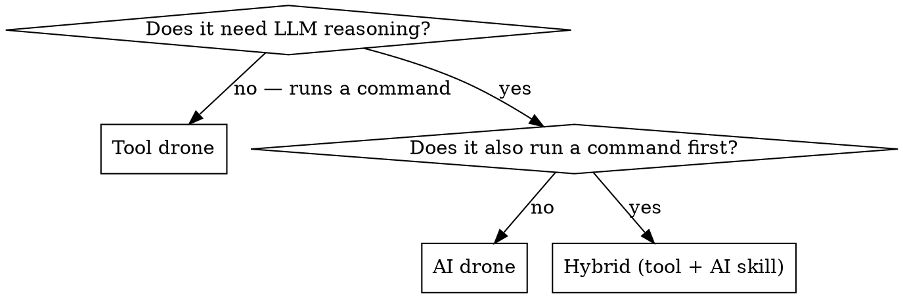

# Create a Custom Drone

## Setup

```bash
npx @missionctl/cli --version 2>/dev/null || echo "Run: npm install -g @missionctl/cli"
```

## Decide: Tool or AI?



| Type | Needs | Examples |
|------|-------|---------|
| **Tool** | Shell command + executor class | linter, formatter, dep-check, bundle-size |
| **AI** | Skill markdown only | code-reviewer, api-designer, refactorer |
| **Hybrid** | Both | test-analyzer (runs tests, then AI explains failures) |

## Step 1: Scaffold

```bash
npx @missionctl/cli drone create <name>
```

Creates: `drone.yaml`, `skills/main.md`, `tests/drone.test.ts`, `package.json`, `README.md`

## Step 2: Edit drone.yaml

The manifest controls when and how the drone activates. Edit every field — don't leave defaults.

```yaml
name: lint-check
description: Runs ESLint and reports code quality issues

triggers:
  keywords:
    - lint
    - eslint
    - code quality

opinions:
  requires: []
  suggests:
    - fix lint warnings before merging
  blocks: []

signals:
  emits:
    - lint-check.done
  listens:
    - coder.done       # run after coder finishes

priority: 35            # after coder(50), before reviewer(10)
escalation: user
```

## Step 3: Write the Skill (AI and hybrid drones)

Edit `<name>/skills/main.md`. This is what Claude reads when acting as this drone.

**Every AI drone skill MUST include:**
1. What to read: `Read .mctl/mission/scout.json for project context`
2. What to do: step-by-step instructions
3. Where to write output: `Write results to .mctl/mission/<name>.md`
4. What to report back: one-line status

**Example skill for a code-review drone:**
```markdown
# Code Review Drone

1. Read .mctl/mission/scout.json for project structure
2. Read .mctl/mission/coder.md to see what was changed
3. Run `git diff HEAD~3` to see actual changes
4. Review for: correctness, edge cases, security, naming, patterns
5. Write findings to .mctl/mission/code-review.md
6. Report: "Review complete — N issues found" or "Review complete — clean"
```

## Step 4: Create Executor (tool drones only)

Tool drones need a TypeScript executor class. Create at `packages/core/src/drones/executors/<name>-executor.ts`:

```typescript
import { execSync } from 'child_process';
import type { DroneResult } from '../drone-runner.js';

export class LintCheckExecutor {
  constructor(private projectDir: string) {}

  async execute(): Promise<DroneResult & { issues: number; output: string }> {
    try {
      const output = execSync('npx eslint . --format json', {
        cwd: this.projectDir, encoding: 'utf-8',
        timeout: 30000, stdio: ['pipe', 'pipe', 'pipe'],
      });
      return { summary: 'Lint passed — no issues', issues: 0, output };
    } catch (err) {
      const e = err as { stdout?: string; status?: number };
      return {
        summary: `Lint found issues (exit ${e.status})`,
        issues: e.status ?? 1,
        output: (e.stdout ?? '').slice(-2000),
      };
    }
  }
}
```

Then export from `packages/core/src/index.ts` and add to `packages/cli/src/commands/drone-exec.ts`.

## Step 5: Test

```bash
# Install the drone locally
npx @missionctl/cli drone add ./<name>

# Verify it shows in fleet
npx @missionctl/cli drone list
npx @missionctl/cli drone info <name>
```

## Step 6: Share

```bash
# Push to GitHub
cd <name> && git init && git add . && git commit -m "Initial drone"
# Others install with:
# git clone <url> && npx @missionctl/cli drone add ./<name>
```

## Common Mistakes

| Mistake | Fix |
|---------|-----|
| Leaving default drone.yaml unchanged | Edit every field — name, description, triggers, signals, priority |
| AI skill says "do your thing" | Write specific steps with exact file paths to read/write |
| Forgetting `.mctl/mission/` output | Every drone must write its results to `.mctl/mission/<name>.md` |
| Setting priority wrong | Higher = runs earlier. Match to dependency order. |
| Not adding `listens` signals | If your drone depends on coder finishing, add `coder.done` to listens |
