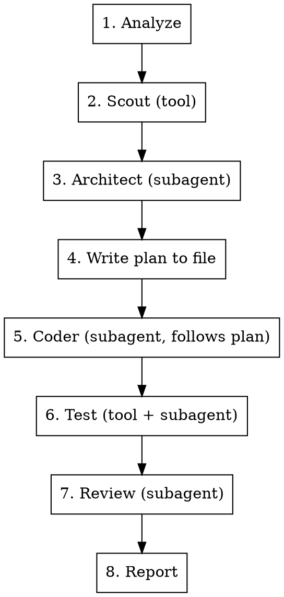

# Swarm Mission Runner

Orchestrate a mission using the Swarm framework. Each AI drone runs as an isolated subagent with its own fresh context. Drones communicate through files in `.swarm/mission/`, not through the parent context. The parent (you) stays lean — dispatch, collect status, report.

## CRITICAL: How to Run Swarm Commands

```
bash "${CLAUDE_PLUGIN_ROOT}/bin/swarm" <command> [args]
```

**NEVER:** `npx swarm`, `node .../bin/swarm`, `swarm` directly.

Fallback if `CLAUDE_PLUGIN_ROOT` is unset:
```bash
SWARM_ROOT="$(find ~/.claude/plugins -path '*/swarm/bin/swarm' -print -quit 2>/dev/null | xargs dirname | xargs dirname)"
SWARM="bash ${CLAUDE_PLUGIN_ROOT:-$SWARM_ROOT}/bin/swarm"
```

## Process



### Step 1: Analyze + Setup

```bash
$SWARM analyze "$ARGUMENTS"
mkdir -p .swarm/mission
```

Parse the JSON. Save it:
```bash
$SWARM analyze "$ARGUMENTS" > .swarm/mission/analysis.json
```

Tell the user: intent, scope, which drones activate.

### Step 2: Scout (tool drone — zero tokens)

```bash
$SWARM drone exec scout > .swarm/mission/scout.json
```

This scans the project and writes results to a file that all subsequent drones will read.

### Step 3: Architect (subagent)

**For trivial/small scope:** Skip this. Go straight to coder.

**For medium+ scope:** Dispatch an architect subagent:

```
Agent tool:
  description: "Architect drone: design solution"
  model: sonnet
  prompt: |
    You are the Architect drone for a swarm mission.

    TASK: $ARGUMENTS

    Read .swarm/mission/scout.json for project context.

    Your job:
    1. Read the scout results to understand the project structure
    2. Design the solution — what files to create/modify, what approach to take
    3. Write a step-by-step implementation plan with exact file paths and code

    Write your design to .swarm/mission/architect.md with this structure:
    ## Design
    [2-3 sentences on approach]

    ## Plan
    - [ ] Step 1: [exact action with file path]
    - [ ] Step 2: [exact action with file path]
    ...

    ## Files
    - Create: [paths]
    - Modify: [paths]

    Keep it concise. The coder will follow this exactly.

    Report back: "Design written to .swarm/mission/architect.md" + one-line summary.
```

**After architect returns:** Read `.swarm/mission/architect.md` and show the design to the user. Get approval before proceeding.

### Step 4: Coder (subagent)

Dispatch a coder subagent that follows the plan:

```
Agent tool:
  description: "Coder drone: implement solution"
  model: sonnet
  prompt: |
    You are the Coder drone for a swarm mission.

    TASK: $ARGUMENTS

    Read these files for context:
    - .swarm/mission/scout.json (project structure)
    - .swarm/mission/architect.md (design + plan to follow)

    Your job:
    1. Follow the plan in architect.md step by step
    2. Write clean code matching existing project patterns
    3. Write tests alongside your code (TDD if the project uses tests)
    4. Commit after each logical unit of work

    Running tests in this project:
    - Package files: `pnpm test`
    - Root-level files: `pnpm exec vitest run tests/<file>.test.ts`
    - NEVER use: npx vitest, turbo test, node_modules/.bin/vitest

    Write a summary to .swarm/mission/coder.md:
    ## Changes
    - [file]: [what changed]

    ## Tests
    - [test file]: [what it tests]

    Report back: "Implementation complete" + files changed list.
```

### Step 5: Test (tool drone + verification)

Run the tool tester first:
```bash
$SWARM drone exec tester > .swarm/mission/tester.json
```

If tests fail, dispatch a fix subagent:
```
Agent tool:
  description: "Fix failing tests"
  model: sonnet
  prompt: |
    Tests are failing. Read:
    - .swarm/mission/tester.json (test output)
    - .swarm/mission/coder.md (what was changed)

    Fix the failing tests. Run tests with:
    - Package files: `pnpm test`
    - Root files: `pnpm exec vitest run tests/<file>.test.ts`

    Report: what was wrong and what you fixed.
```

### Step 6: Review (subagent)

```
Agent tool:
  description: "Reviewer drone: final quality check"
  model: haiku
  prompt: |
    You are the Reviewer drone. Review code changes for this mission.

    Read:
    - .swarm/mission/architect.md (intended design)
    - .swarm/mission/coder.md (what was implemented)

    Run: `git diff HEAD~3` (or appropriate range) to see actual changes.

    Check for:
    - Does implementation match the design?
    - Edge cases missed?
    - Security issues?
    - Code quality?

    Write findings to .swarm/mission/reviewer.md.
    Report: "Review complete" + one-line verdict (clean / issues found).
```

### Step 7: Report

Read all `.swarm/mission/*.md` files and summarize:

```
| Drone     | Result                                    |
|-----------|-------------------------------------------|
| scout     | Scanned N files, detected [stack]         |
| architect | Designed: [brief approach]                |
| coder     | Created/modified [files]                  |
| tester    | N/N tests passing                         |
| reviewer  | [findings or "clean"]                     |
```

## Token Efficiency Rules

**The parent (you) must stay lean.** Your only job is dispatch + collect.

1. **NEVER read full file contents in the parent.** Subagents read files themselves.
2. **Subagent prompts are short** — task + file paths to read. Not full context.
3. **Subagent results are short** — "done, wrote to X" + one-line summary. Not full code.
4. **Communication is via `.swarm/mission/` files.** Drones read previous drone outputs from files, not from parent context.
5. **Use the cheapest model that works:**
   - architect: sonnet
   - coder: sonnet
   - debugger: opus (needs deep reasoning)
   - reviewer: haiku (quick check)
   - docs: haiku
6. **Max 4 AI subagents per mission.** For trivial tasks, skip architect and reviewer.
7. **For trivial/small scope:** Don't use subagents at all. Just do the work directly.

## Scope-Based Behavior

| Scope | Drones | Subagents? |
|-------|--------|-----------|
| trivial | coder only | No — do it yourself |
| small | scout → coder → tester | No — do it yourself |
| medium | scout → architect → coder → tester → reviewer | Yes — subagents |
| large | scout → architect → security → coder → tester → reviewer → docs | Yes — subagents |

## Running Tests

**Package files** (packages/core/*, packages/cli/*):
```bash
pnpm test
```

**Root-level files** (src/*, tests/*):
```bash
pnpm exec vitest run tests/your-test.test.ts
```

**NEVER:** `npx vitest`, `vitest run`, `node_modules/.bin/vitest`, `turbo test`

## Common Mistakes

| Mistake | Fix |
|---------|-----|
| Using `npx swarm` | Use `bash "${CLAUDE_PLUGIN_ROOT}/bin/swarm"` |
| Dumping full scout output into parent context | Save to file, let subagents read it |
| Skipping the plan | Architect must write a plan. Coder follows it. |
| Having subagents return full code | They write to files, return one-line status |
| Using opus for simple tasks | Match model to complexity (see table) |
| Running all drones for a typo fix | Trivial/small = do it yourself, no subagents |
