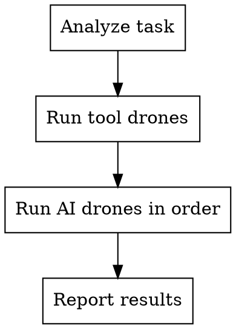

# Swarm Mission Runner

Orchestrate a mission using the Swarm framework. Tool drones run CLI commands. AI drones are you acting in role.

## CRITICAL: How to Run Swarm Commands

The `swarm` CLI is a bash script. Always invoke it with `bash`:

```
bash "${CLAUDE_PLUGIN_ROOT}/bin/swarm" <command> [args]
```

**NEVER use:**
- `npx swarm` (not an npm binary)
- `node .../bin/swarm` (it's a bash script, not JS)
- `swarm` directly (not in PATH)

If `CLAUDE_PLUGIN_ROOT` is not set, find it:
```bash
# Usually set by Claude Code. If not:
SWARM_ROOT="$(find ~/.claude/plugins -path '*/swarm/bin/swarm' -print -quit 2>/dev/null | xargs dirname | xargs dirname)"
```

Store the prefix for reuse:
```
SWARM="bash ${CLAUDE_PLUGIN_ROOT:-$SWARM_ROOT}/bin/swarm"
```

## Process



### Step 1: Analyze

```bash
bash "${CLAUDE_PLUGIN_ROOT}/bin/swarm" analyze "$ARGUMENTS"
```

Returns JSON. Parse it. Tell the user:
- **Intent** and **scope** detected
- **Drones** that will activate (tool vs AI)
- **Execution plan** with parallel groups

### Step 2: Run Tool Drones

For each drone in the plan where `type === "tool"`, run:

```bash
bash "${CLAUDE_PLUGIN_ROOT}/bin/swarm" drone exec <name>
```

Available tool drones:
| Drone | What it does | Output |
|-------|-------------|--------|
| **scout** | Scans files, detects languages/frameworks | JSON with files[], directories[], languages[] |
| **tester** | Runs project test suite via package manager | JSON with exitCode, output |
| **security** | Runs dependency audit (pnpm/npm/yarn audit) | JSON with vulnerabilities count |

Run scout FIRST — AI drones need its output for context.

### Step 3: Run AI Drones

For each drone where `type === "ai"`, YOU act as that drone. Follow the plan's parallel group order.

**architect** — Design before coding. Read scout results. Propose approach. Get user approval before proceeding.

**coder** — Implement the solution. Follow architect's design. Match existing patterns from scout results.

**debugger** — Investigate systematically. Reproduce → trace → root-cause → fix. Don't guess.

**tester** (AI mode) — After coder writes code, write tests. Use the project's existing test framework.

**reviewer** — Review all changes. Check correctness, edge cases, security, quality.

**docs** — Add documentation only where code isn't self-explanatory.

### Step 4: Running Tests

This is a pnpm monorepo. Test commands depend on where files live:

**For package files** (packages/core/*, packages/cli/*):
```bash
pnpm test
```

**For root-level files** (src/*, tests/*):
```bash
pnpm exec vitest run tests/your-test.test.ts
```

**NEVER use:**
- `npx vitest` (not in root PATH)
- `vitest run` directly (not global)
- `node_modules/.bin/vitest` (fragile path)
- `turbo test` (turbo not in shell PATH)

### Step 5: Report

Summarize what each drone did in a table:

```
| Drone    | Result                                    |
|----------|-------------------------------------------|
| scout    | Scanned N files, detected TypeScript + X  |
| architect| Designed: [brief approach]                |
| coder    | Created/modified [files]                  |
| tester   | N/N tests passing                         |
| reviewer | [findings or "clean"]                     |
```

## Common Mistakes

| Mistake | Fix |
|---------|-----|
| Using `npx swarm` | Use `bash "${CLAUDE_PLUGIN_ROOT}/bin/swarm"` |
| Running vitest at root with npx | Use `pnpm exec vitest run <file>` |
| Skipping scout | Always run scout first — AI drones need its output |
| Creating files without checking structure | Read scout output to understand project layout |
| Running `turbo` directly | Use `pnpm test` which invokes turbo through pnpm |
